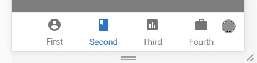

# react-bottomnav

Bottom navigation bar for React.

## Usage

```tsx
class App extends React.Component<{}, AppState> {
  state: AppState = {
    selectedNavLabel: 'Second',
  };

  onNavSelect = (label: string) => {
    this.setState({
      selectedNavLabel: label,
    });
  };

  render() {
    return (
      <Container>
        <BottomNav selectedColor="blue" selectedLabel={this.state.selectedNavLabel} onSelect={this.onNavSelect}>
          <BottomNavItem label="First">
            {/* inline SVG */}
          </BottomNavItem>

          <BottomNavItem label="Second">
            {/* inline SVG */}
          </BottomNavItem>

          <BottomNavItem label="Third">
            {/* inline SVG */}
          </BottomNavItem>

          <BottomNavItem label="Fourth">
            {/* inline SVG */}
          </BottomNavItem>
        </BottomNav>
      </Container>
    );
  }
}
```

## Result



## API

The following are passed as props.

### `BottomNav`

#### `selectedLabel`

- Type: `string`

The currently selected navigation item.

#### `onSelect`

- Type: `(label: string) => void`

Callback invoked when a different navigation item is selected. You'll want to update your state here.

#### `selectedColor` (optional)

- Type: `string` (CSS color)

Color to use for selected navigation items.

### `BottomNavItem`

#### `label`

- Type: `string`

Text used below the navigation item icon. Also used to reference individual navigation items.
